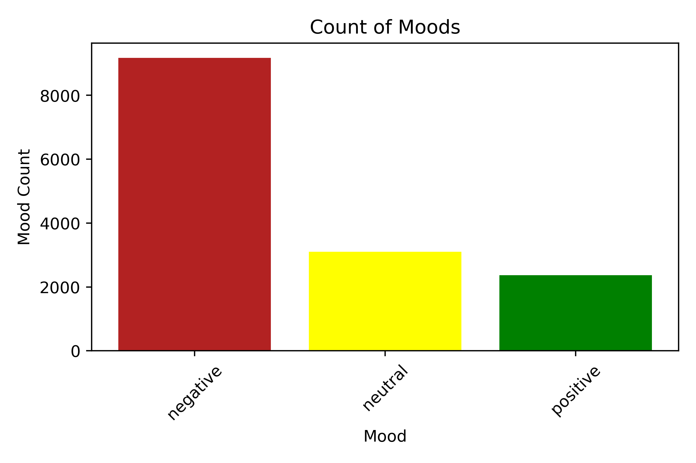
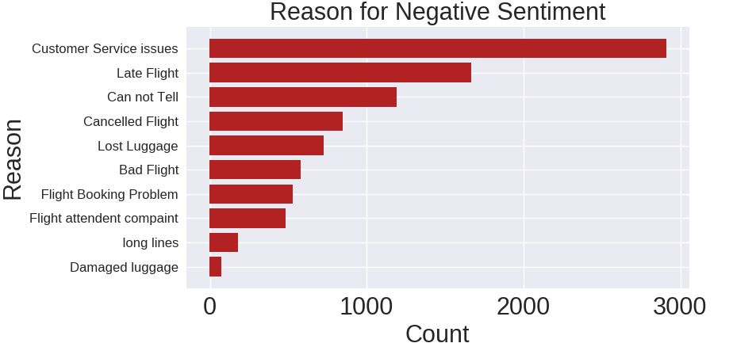

# Twitter Sentiment Analysis 

## Introduction
 I plan to create a sentiment classification model with the sentiment classes being  negative,positive or neutral given tweets received by US airlines. As my baseline I will be using a lexicon and rule-based sentiment analysis called VADER and testing that against a Random forest and naive bayes to see which performs the best.

 Sentiment analysis or opinion mining is an NLP technique that lets you determine the attitude (positive, negative, or neutral) of text.

 With this model that I create from this project an airline company could take these results and understand how their customers are reacting to them and their services  from their twitter data. This is important because this can be used to improve a company's decision making, customer satisfaction and more
 
## Data
The data was a Kaggle data set named [Twitter US Airline Sentiment](https://www.kaggle.com/crowdflower/twitter-airline-sentiment). 
Targets
*Existing sentiment of tweets
Features
*Tweets sent from customers mentioning the airline accounts directly

### Data Cleaning
This data was already very clean for the columns that I ended up using. I did have to do some cleaning of @ signs and hashtags but other than that most of my data processing and feature enginearing was done in the preprocessing stage.

## EDA
This is a graph that shows the segmentation of sentiments though the entire dataset. It is mainly negative because the majority of people tweeting at airlines are complaining about the negative experience that they had.

This graph was made from a user inputed column named “negative sentiment reason” of my dataset that states the reason that the tweet was negative.

## Workflow
1. Read in Data
2. Natural Language Processing  text preprocessing

#### Preprocessing
- Tokenization
- Lower casing
- Stop words removal
- Stemming
- Lemmatization

3. Featurize text using Count Vectorizer 
4. Modeling process 
5. Chose an evaluation metric

## Models
### VADER sentiment 
VADER (Valence Aware Dictionary and sEntiment Reasoner) is a lexicon and rule-based sentiment analysis tool specifically tuned to be used for social media. VADER uses a combination of A sentiment lexicon is a list of lexical features (e.g., words) which are generally labeled according to their semantic orientation as either positive or negative. It also shows how positive or negative the text is.

### Multinomial Naive Bayes
Multnomial Naive Bayes classification is known for being a good classifier for sentiment analysis. The intuition behind Naive Bayes is to find the probability of classes assigned to given text by using the joint probabilities of words and classes. 

### Random Forest
The reason that I decided to try a random forest is because of its ability to handle large data sets with higher dimensionality and with more trees, it won't allow-overfitting trees in a model. 

### Choosing an evaluation metric
I prioritized using the F1-score for my evalusation metric. I did this because it gives a good measure of the incorrectly classified cases. F-1 score is used when the False Negatives and False Positives are the most important. It also does a good job of combatting class imbalance.

### Results
|   | VADER        | F1-Score |
|---|--------------|----------|
|   | Negative     | 66%      |
|   | Neutral      | 40%      |
|   | Positive     | 48%      |
|   | Weighted Avg | 59%      |

|   | VADER        | F1-Score |
|---|--------------|----------|
|   | Negative     | 66%      |
|   | Neutral      | 40%      |
|   | Positive     | 48%      |
|   | Weighted Avg | 59%      |

As Shown above the multinomial naive bayes model significantly outperformed the baseline VADER sentiment.
### Creating Actionable Insights 
After evaluating my models and choosing to continue with my multinomial naive bayes I then wanted to extract the top 10 words associated with the positive and negative sentiments so that I could find meaningful insights from my model. As shown above 

Reasons for negative sentiment

* Delayed or Cancelled flights
* Poor Customer Service
* Loss of luggage 

Reasons for positive sentiment 

* Great Flight 
* Great customer service 
* Flight was on time 

Suggestions for the airline companies.
* These insight are more of a guide to possible problems that should be investigated further. Given thatI would look into the following things.

    * Investigate if customer service is a continuing issue within the airline and if it is then I would revamp the customer service training program. 
    * Look into if there are any substantial issues that can be solved around delayed or cancelled flights.

